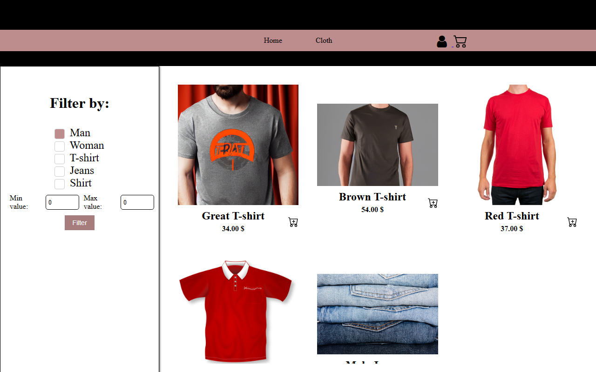
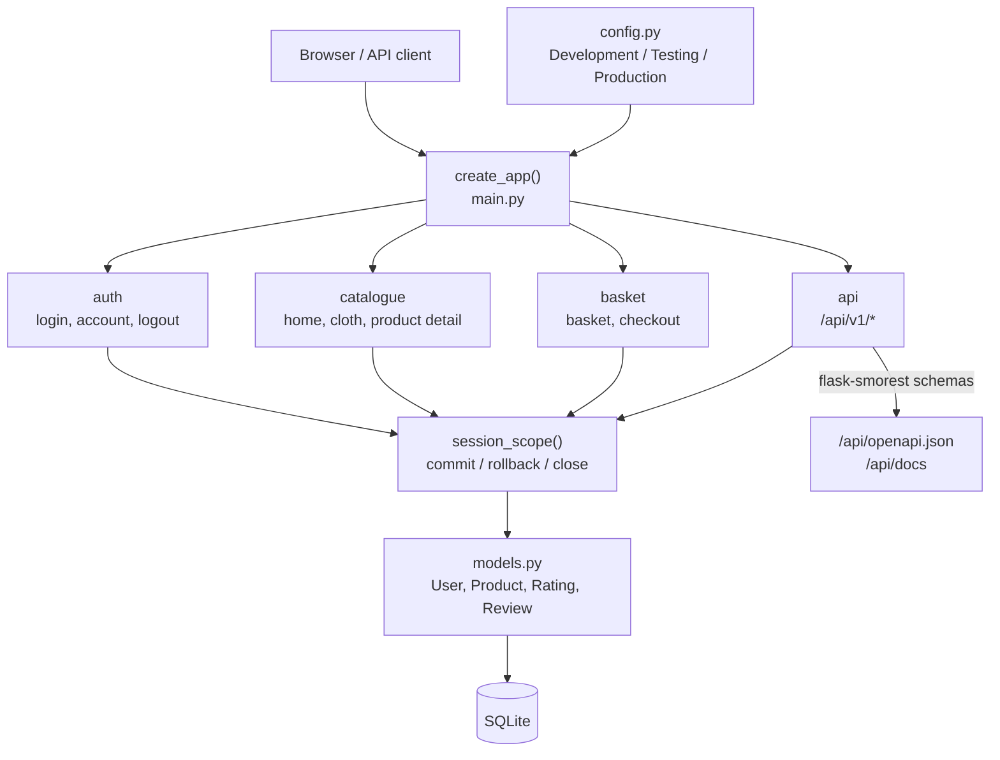
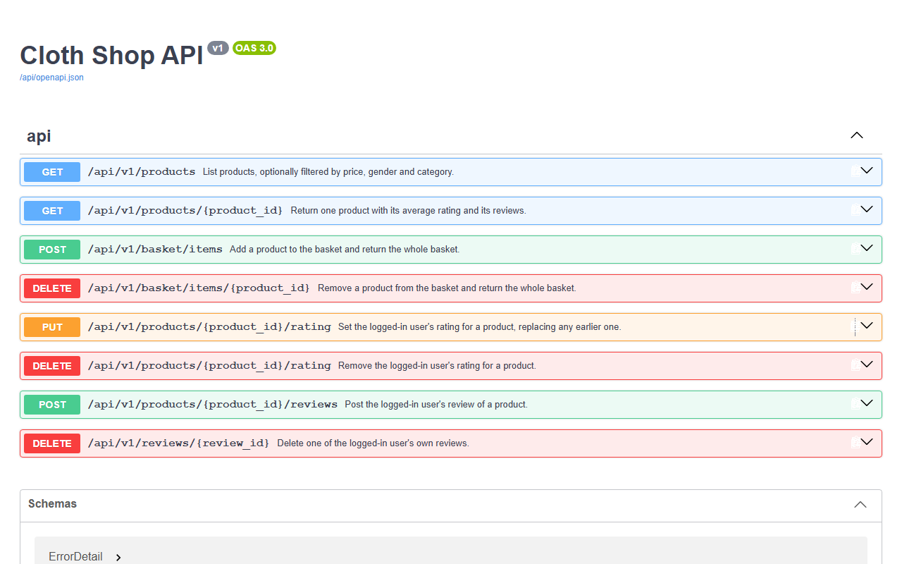
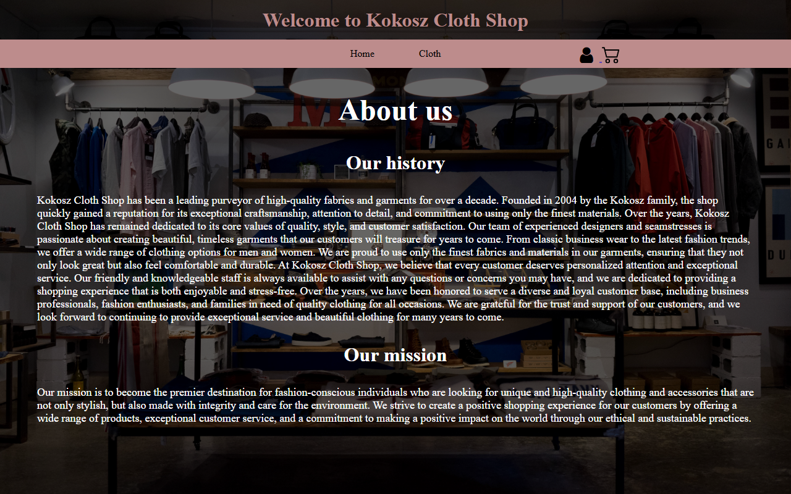
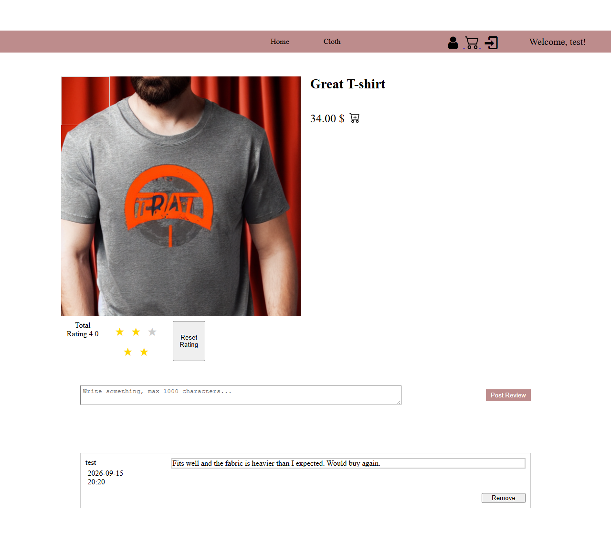
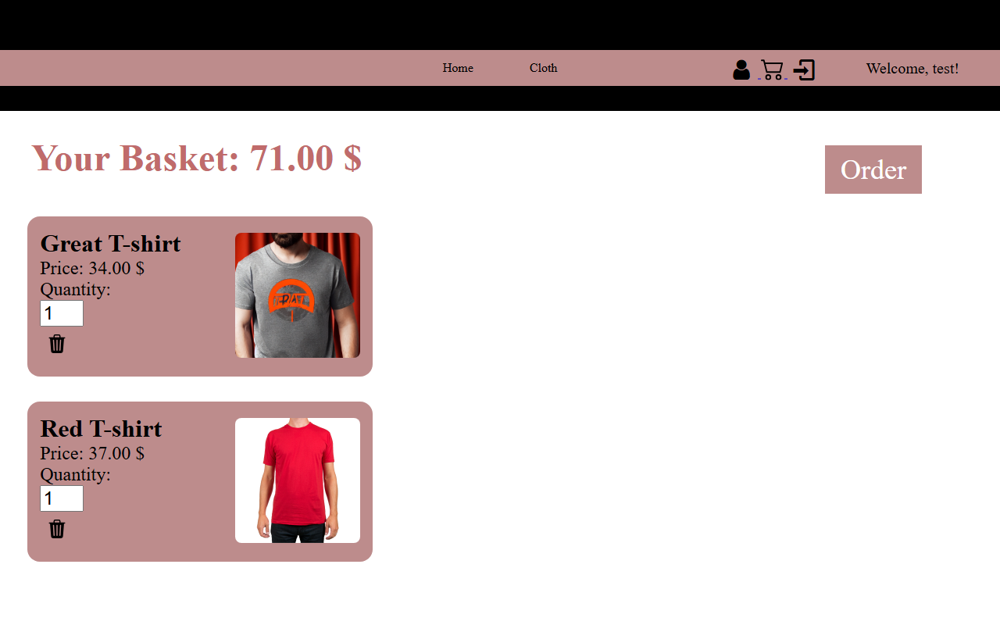
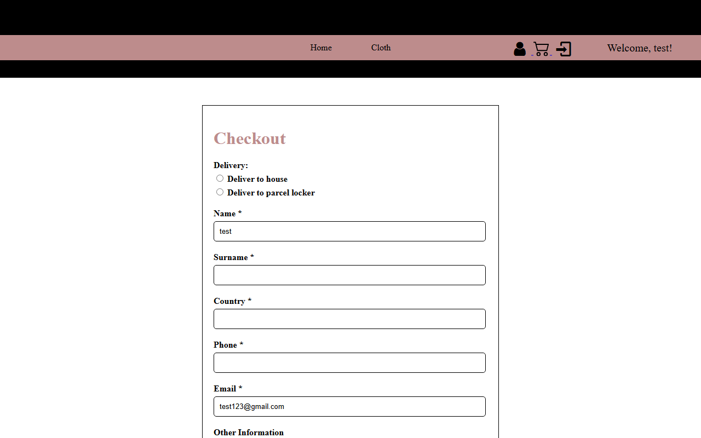

# Cloth Shop Website

A small e-commerce site built with Flask: browse a catalogue, filter it, rate and
review products, fill a basket and check out. It also exposes a documented JSON
API over the same data.

The project began as a learning exercise and has since been reworked into a
demonstration of how the same code looks when security, testing and deployment
are treated as requirements rather than afterthoughts. The sections below explain
the decisions behind that, not just the result.



## Architecture

The app is built by a factory, `create_app`, so tests and production create
independent instances from the same code with different settings. Routes live in
four blueprints, every database session is opened through one context manager,
and the API's request and reply shapes double as its OpenAPI document.



## Run it

The image carries its own dependencies and seeds a database on first start, so
this is the shortest path from clone to running shop:

```bash
cd cloth-shop
cp .env.example .env          # then put a value in SECRET_KEY
docker compose up --build
```

The shop is then on http://localhost:5000 and the API documentation on
http://localhost:5000/api/docs.

### Running from source

```bash
pip install -r cloth-shop/requirements.txt
python cloth-shop/Web/create_database.py     # first run only
python cloth-shop/Web/main.py
```

Two accounts come from the seed data: `test` / `123` and `test123` / `test123`.
Those passwords are plaintext only in `Databases/json/data.json`; the seeding
script passes every one through `User.set_password`, so what reaches the database
is a hash.

## Configuration

Settings come from the environment, and `config.py` picks a class based on
`APP_ENV`. Nothing secret is committed — `.env` is ignored and `.env.example`
records the shape.

| Variable | Default | Purpose |
| --- | --- | --- |
| `APP_ENV` | `development` | Which settings class to use: `development`, `testing` or `production` |
| `SECRET_KEY` | random per start | Signs the session cookie. **Production refuses to start without it** |
| `DATABASE_URL` | `sqlite:///Databases/mydb.db` | SQLAlchemy database URL |

A random `SECRET_KEY` is convenient in development and wrong in production: it
changes on every restart, which silently logs every user out. Production asks for
one explicitly rather than papering over it.

## API

The JSON endpoints live under `/api/v1`. They describe themselves: the OpenAPI
document is served at `/api/openapi.json` and a browsable version at `/api/docs`.



The request and reply shapes in that document are the same schemas the app
validates and serialises with, so the document cannot drift away from what the
code actually accepts and returns.

Two things are worth knowing:

1. Products are addressed by integer id, for example `/api/v1/products/3`. An
   earlier plan used the name-based URL the product page uses,
   `/cloth/product_detail/Blue-Jeans`, but that slug is built from the name
   alone: two products called the same thing would share one URL, and renaming a
   product would break every link to it. The page keeps its readable URL and the
   API uses ids throughout.
2. The `/api/docs` page loads Swagger UI from a CDN, so it needs internet access.
   The OpenAPI document itself is served by the app and works offline.

Every failure replies with the same shape, `{"error": {"code", "message"}}`, and
a real status code: 400 for a request the API cannot accept, 401 when you are not
logged in, 404 for something that is not there, 409 for a review that already
exists.

## Testing

Four layers, each answering a question the others cannot.

| Layer | What it covers | Run it | In CI |
| --- | --- | --- | --- |
| Unit and integration (105 tests) | Models, config, password handling, database failures, every API endpoint, the URL map | `pytest` | yes, with coverage |
| Playwright journey (1 test) | One full path through a real browser: filter, add to basket, confirm | `pytest automation-tests/playwright` | yes |
| Selenium (22 tests) | Login, logout, filters and basket flows in Firefox | `pytest automation-tests/selenium -m browser` | no, local only |
| Manual (Jira export) | Exploratory cases and bug reports | see [manual-tests](../manual-tests) | no |

Coverage is 87%. The Selenium suite sits behind an opt-in `browser` marker
because it needs Firefox and a shop already running on port 5000; CI runs the
Playwright journey instead, which manages its own browser.

Two of these layers exist in their current form because of specific mistakes,
which is the more useful thing to know about them:

- The Selenium suite originally asserted nothing and ran its steps at import
  time, so it could not fail and therefore could not report anything. It was
  rewritten into tests that can.
- Every logout test logged in first, so nobody had tested logging out *without* a
  session — the case where the view returned `None` and Flask answered 500. The
  fix arrived with a test that fails against the old code.

## Security

The app originally stored passwords in plaintext. Fixing that was the start
rather than the end; the decisions below are the ones worth explaining.

**Passwords are hashed, including the seeds.** `User.set_password` hashes with
`werkzeug.security` and the column only ever holds the hash. A migration script
for databases created before this change is in `scripts/`.

**Session cookies are hardened.** `HttpOnly` keeps them away from JavaScript,
`SameSite=Lax` stops other sites sending them along with cross-site requests, and
`Secure` restricts them to HTTPS. Development turns `Secure` off, because local
HTTP would otherwise drop the cookie entirely.

**Three deliberate authentication cases, not one blanket rule.** A page that
needs an account redirects to the login form, because a browser should be shown
somewhere to go. An API action that needs an account returns `401` with the
standard error body, because a client wants a status code, not an HTML page.
Browsing, the basket and checkout stay open to guests on purpose — requiring an
account to look at a shop loses sales.

**Authorisation is checked, not assumed.** Deleting a review is scoped to the
review's owner, so knowing another review's id is not enough to delete it.

**The database enforces its own rules.** Primary keys are assigned by the
database rather than counted in Python; usernames, emails and
one-rating-per-user-per-product are unique constraints; and the rating range is
validated on assignment, so a bad value fails at the model rather than at the
template.

**Failures are typed by layer.** The database layer raises `ProductNotFound`,
`UserNotFound`, `DuplicateUser` or `DuplicateReview` instead of returning `None`
or `False`, and each maps to one HTTP status in one place.

**Nothing secret is in the repository.** `.env` is ignored, `.env.example` shows
what to set, and the container runs as a non-root user with the database on a
mounted volume.

Two things were **removed rather than fixed**, which is worth stating plainly:

- **Email verification was deleted.** The signup flow stored the password and the
  verification code in a cookie, and there was no working sender. A broken
  feature that leaks credentials is worse than no feature.
- **CSRF tokens were not added.** With `SameSite=Lax` cookies, the cross-site
  request those tokens defend against does not carry a session, so they would be
  defence-in-depth on a door that is already shut. Worth adding if the cookie
  policy ever loosens.

## Screenshots

| | |
| --- | --- |
|  |  |
|  |  |

They are generated rather than collected: `scripts/take_screenshots.py` drives a
running shop with Playwright and rewrites the files, so they can be refreshed
when the interface changes.

## Documentation

[Project documents](./Documents) holds the original project documentation — its
goals, scope and technology choices — and the Jira issue export listing tasks,
test cases and bugs raised against the shop.
